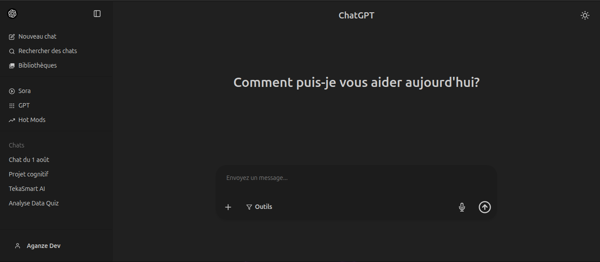

# ChatGPT Clone 🚀

Un clone moderne de l'interface ChatGPT avec mode sombre, historique des conversations et réponses simulées, construit avec les dernières technologies frontend.

<div align="center">
  
</div>

[**🔗 Live Demo**](https://chatgpt-clone-q5ae.vercel.app/)

## ✨ Features

- **Interface fidèle** à ChatGPT avec animations fluides
- **Mode sombre/clair** persistant (localStorage)
- **Sidebar** avec historique des conversations
- **Réponses IA simulées** en temps réel
- **100% responsive** (mobile/desktop)
- **Optimisé pour l'UX** (soumission avec Entrée, auto-scroll, etc.)

## 🛠 Stack Technique

- ⚡ [Vite](https://vitejs.dev/) - Build tool ultra-rapide
- � [React 19](https://react.dev/) + TypeScript
- 🎨 [Tailwind CSS](https://tailwindcss.com/) - Utility-first CSS
- 🌼 [DaisyUI](https://daisyui.com/) - Composants Tailwind prêts à l'emploi
- ✨ [React Icons](https://react-icons.github.io/react-icons/) - Bibliothèque d'icônes

## 🚀 Installation

1. **Cloner le repo**
   ```bash
   git clone https://github.com/votre-user/chatgpt-clone.git
   cd chatgpt-clone
   ```
2. **installation et lancement**
   ```bash
   npm install
   npm run dev
   ```

## ✨ Auteur

**AGANZE MOISE**

- [Portfolio](https://moiseaganze.vercel.app/)
- [Email](aganzedev@gmail.com)
